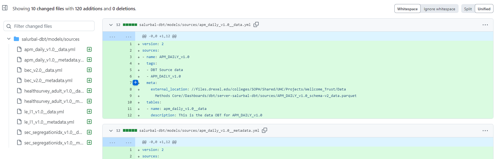
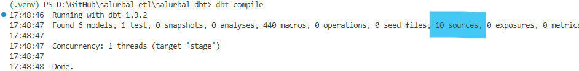
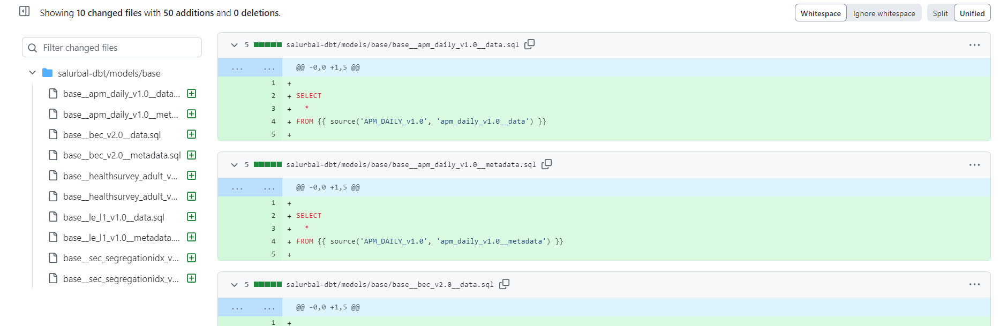
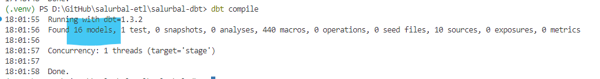
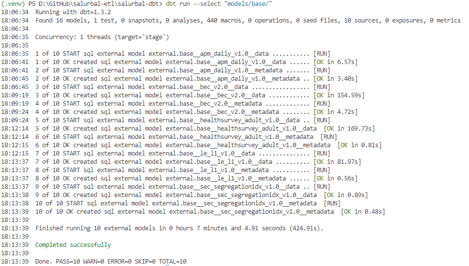
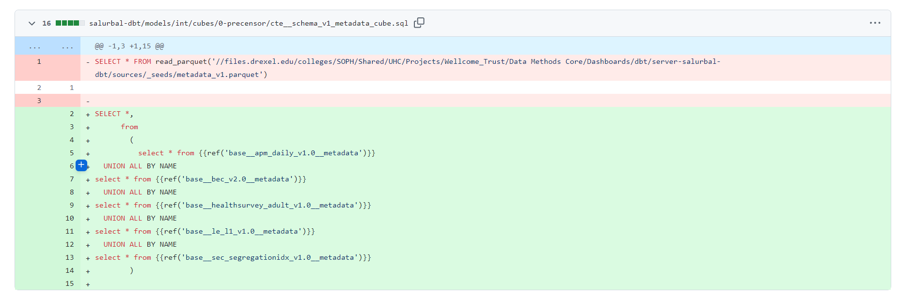
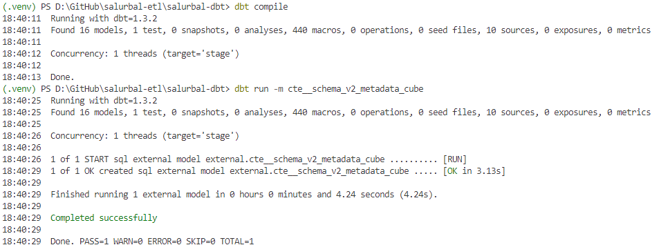
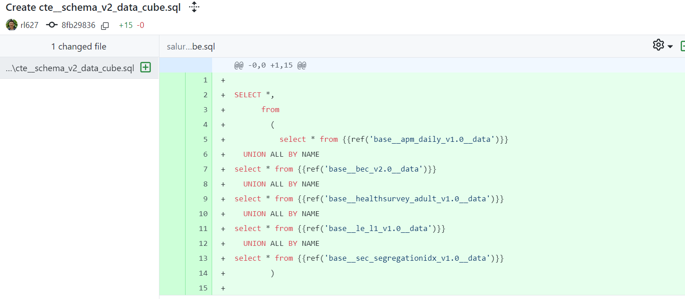
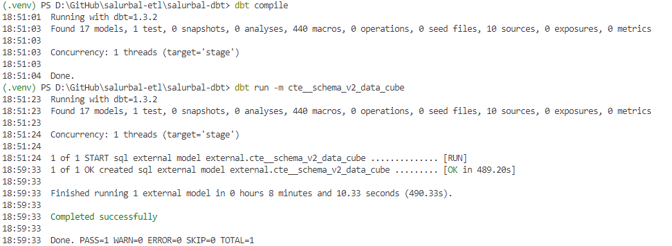

```{r}
#| code-summary: 'Setup'
#| code-fold: true


setwd(here::here('_dbt/.automations'))
pacman::p_load(tidyverse,yaml, arrow, assertr, reactable, glue, cli, here)
R_files <- list.files(path = 'R', all.files = TRUE,
                      recursive = TRUE, full.names = TRUE,
                      pattern = '\\.R$') %>%
  discard(~str_detect(.x, 'source_parent'))
for (file in R_files) {
  tryCatch({
    source(file, local = T)
  }, error = function(e) {
    warning(paste("Error sourcing file:", file, "\nError message:", e$message))
  })
}
    
local_context = lst(
  df_inventory_schema_v2 = list.files(
    here("_shared_storage/4_standardized/"), 
    pattern = '_loading.parquet',
    full.names = T
  ) %>% 
    map_df(~read_parquet(.x) %>%
             select(where(~ !is.list(.)))) %>% 
    mutate(
      across(contains("path_dbt"), 
             ~str_replace_all(., 'server-salurbal-dbt', 'salurbal-dbt-server'))
    ),
  df_production_inventory = df_inventory_schema_v2  %>% 
    add_count(dataset_id) %>% 
    arrange(desc(n), dataset_id, dataset_version, schema_version) %>% 
    select(n, everything())%>% 
    select(-n) %>% 
    group_by(dataset_id) %>% 
    filter(
      dataset_version == max(dataset_version),
      schema_version == max(schema_version)
    ) %>% 
    ungroup() %>%
    assert(is_uniq, dataset_id) %>% 
    verify(all(df_inventory_schema_v2$dataset_id %in% pull(., dataset_id)))
)

```

# 1. Inputs


## Schema v2 datasets

We have our basic global setup and then we operationlized an inveotry of production cube assets that were staged as sources. Let preview that first

```{r}

local_context$df_production_inventory %>% 
  select(
  dataset_instance, observation_type, renovation_render_date ) |> 
  reactable()

```

## Schema v2 Cubes

Note that for each dataset we will operationalize both data and metadata cubes, so lets reshape so its one row per actual dataset-model-type.

```{r}
## Clean
df_salurbal_source_input = local_context$df_production_inventory  %>% 
  select(dataset_instance, 
         path_dbt_source_data, 
         path_dbt_source_metadata) %>%  
  pivot_longer(cols = -dataset_instance,
              values_to = 'path_absolute') %>% 
  mutate(
    path = file.path("..", str_extract(path_absolute, "_shared_storage.*")),
    type = str_remove_all(name, "path_dbt_source_"),
         source_model_id = glue('{dataset_instance}__{type}') %>% str_to_lower(),
         base_model_id = glue("base__{dataset_instance}__{type}") %>% str_to_lower(),
         int_model_id = glue("int__{dataset_instance}") %>% str_to_lower(),
         precore_model_id = glue("precore__{dataset_instance}") %>% str_to_lower()
  ) %>%
  verify(has_both_data_metadata(.))

## Preview
df_salurbal_source_input %>% 
  select(-path) |> 
  select(dataset_instance, type, name, everything()) |> 
  reactable()
```

With this we can begin the DBT automation process of:

1.  Generating Source YAMLs that tell DBT it can use these cubes
2.  Generate base models that import these into DBT
3.  Generate pre-censor core model that compiles these into project wide cubes

# 2. DBT Source (YML)

## Function breakdown

We have a function that does this, which we iterate over but for transparency lets break that function down here. We start with a row in our inventory which is a single dataset instance.

```{r}
row = df_salurbal_source_input %>% slice(1)
glimpse(row)
```

### Prep

We start with just setting up the end path.

```{r}
model_id = row$source_model_id
src_endpoint = glue('../models/sources/{model_id}.yml')
cli_alert("Start source.yml generation for - {model_id}")
```

### Generate

```{r}
{ # source.yml --------------------------------------------------------------
  
 source_yml =  list(
    version = as.integer(2),
    sources = list(
      list(
        name = row$dataset_instance,
        tags = c(glue('DBT Source {row$type}'), row$dataset_instance),
        meta = list(external_location = row$path),
        tables = list(
          list(
            name = model_id,
            description =  ifelse(
              row$type == 'data',
              glue('This is the data OBT for {row$dataset_instance}'),
              glue('This is the metadata OBT for {row$dataset_instance}')
            ) ) ) ) ) )
}

## Preview
source_yml %>% jsonlite::toJSON(pretty = T)
```

Looks good. Note that in the future we can include column metadata for for simplicity sake lets just start with the basic information.

### Write

Now the last step is just to write this YAML to the DBT repository

```{r}
#| eval: false
{ # Write -------------------------------------------------------------------
  write_yaml(source_yml, src_endpoint)
  cli_alert_success("Write source.yml for {model_id}")
}
```

## Iterate

Again the logic above is contained within a function called `generate_source_yml()` you can find document within the funciton or on its Notion page.

```{r}
df_salurbal_source_input %>%
  group_by(row_number()) %>% 
  group_walk(~generate_source_yml(.x))
```

Okay. Lets just take a look at our git diff to make sure code changes are as expected - details of this diff can be found in this [commit](https://github.com/Drexel-UHC/salurbal-etl/commit/f9d68a44d5b4bd25f71aa1b38b89bac618130fd1).



As always after making changes to our DBT Project, lets do a compile check to make sure things are okay by running `dbt compile`.



Okay looks good. Lets move on to the next layer - base models

# 2. DBT Base Models (SQL)

## Function breakdown

We have a function that does this, which we iterate over but for transparency lets break that function down here. We start with a row in our inventory which is a single dataset instance.

```{r}
row = df_salurbal_source_input %>% slice(1)
glimpse(row)
```

Writing SQL is taking a tempalte SQL text file then parameterizing it with certain values. Lets first start with the tempalte.

### Template

Our tempalte is simple, just import the whole table from a specific source file - as determiend by two parameters `dataset_instance` and `source_model_id`.

```{r}
base_model_template_sql <-  "
SELECT
  *
FROM {{ source('{{ dataset_instance }}', '{{ source_model_id }}') }}
{{ limit_data_in_dev() }}
"
```

### Prep

We get some local variables named for templating and path generation.

```{r}
{# Setup -------------------------------------------------------------------
  dataset_instance = row$dataset_instance 
  model_id = row$base_model_id
  path = row$path
  base_model_sql_name = glue("{model_id}.sql")
  sql_endpoint =  glue("../models/base/{base_model_sql_name}")
  cli_alert("Start base__model.sql for {model_id}")
}

```

### Render

Now we fill in the parameters in the tempalte. Note that we call the limit data in dev macro for base models that are data; we want to bring in all the metadata even in the development. 

```{r}
{ # Generate .sql -------------------------------------------------------------
  base_model_template_sql <- gsub("\\{\\{\\s*dataset_instance\\s*\\}\\}",dataset_instance, base_model_template_sql)
  base_model_template_sql <- gsub("\\{\\{\\s*source_model_id\\s*\\}\\}",row$source_model_id, base_model_template_sql)
  base_model_template_sql <- gsub("\\{\\{\\s*limit_data_in_dev\\s*\\}\\}",
                                  ifelse(row$type=='data','{{ limit_data_in_dev() }}',''), 
                                  base_model_template_sql)
}
```

### Write

```{r}
#| eval: false

{# Write .sql --------------------------------------------------------------
  write(base_model_template_sql, file = sql_endpoint)
  cli_alert_success("{base_model_sql_name} written")        
}
```

## Iterate

Again, lets iterate over all the ingested cubes.

```{r}
df_salurbal_source_input %>% 
  group_by(row_number()) %>% 
  group_walk(~write_dbt_base_model(.x, context))
```

Okay. Lets just take a look at our git diff to make sure code changes are as expected - details of this diff can be found in this [commit](https://github.com/Drexel-UHC/salurbal-etl/commit/0f1080d553a4528886e30ac3bf19780a6bce0227).



Looks good - we generate 10 new base models. As always, any changes to DBT project should be checked with `dbt compile`.



Okay. Since we added some models we can actually run them to make sure they work. Lets do that here with \`dbt run



Base models work. Lets move one more layer up which is the compiled interemdaite cubes.


## Schema.yml

Here we just create a YAML file to add base level metadta

```{r}
generate_base_schema_yml <- function(df_models) {
  # Extract base model IDs from the data frame
  base_model_ids <- df_models$base_model_id
  
  # Create yaml structure
  schema_yaml <- list(
    version = as.integer(2),
    models = list()
  )
  
  # Add each model to the schema
  for (model_id in base_model_ids) {
    # Extract model parts for better descriptions
    parts <- unlist(strsplit(model_id, "__"))
    dataset_parts <- unlist(strsplit(parts[2], "_v"))
    dataset_name <- dataset_parts[1]
    version <- sub("\\.$", "", dataset_parts[2])  # Remove trailing dot if present
    type <- parts[3]
    
    # Replace dots with underscores for DBT compatibility
    model_name <- gsub("\\.", "_", model_id)
    
    # Generate description based on dataset and type
    description <- ""
    if (type == "data") {
      description <- paste0(
        case_when(
          dataset_name == "apm_daily" ~ "Air Pollution Monitoring daily measurements",
          dataset_name == "bec" ~ "Built Environment Characteristics",
          dataset_name == "bec_restricted" ~ "Restricted Built Environment Characteristics",
          dataset_name == "healthsurvey_adult" ~ "Health Survey data for adults",
          dataset_name == "healthsurvey_child" ~ "Health Survey data for children",
          dataset_name == "le_l1" ~ "Life Expectancy L1",
          dataset_name == "sec_segregationidx" ~ "Socioeconomic Segregation Index",
          TRUE ~ str_replace_all(dataset_name, "_", " ")
        ),
        " data (version ", version, ")"
      )
    } else {
      description <- paste0(
        "Metadata for ",
        case_when(
          dataset_name == "apm_daily" ~ "Air Pollution Monitoring daily measurements",
          dataset_name == "bec" ~ "Built Environment Characteristics",
          dataset_name == "bec_restricted" ~ "restricted Built Environment Characteristics",
          dataset_name == "healthsurvey_adult" ~ "Health Survey data for adults",
          dataset_name == "healthsurvey_child" ~ "Health Survey data for children",
          dataset_name == "le_l1" ~ "Life Expectancy L1",
          dataset_name == "sec_segregationidx" ~ "Socioeconomic Segregation Index",
          TRUE ~ str_replace_all(dataset_name, "_", " ")
        ),
        " (version ", version, ")"
      )
    }
    
    # Add model to schema
    model_entry <- list(
      name = model_name,
      description = description,
      tags = list("base")
    )
    
    schema_yaml$models <- c(schema_yaml$models, list(model_entry))
  }
  
  return(schema_yaml)
}

# Generate and write schema.yml file
write_base_schema_yml <- function(df_salurbal_source_input, output_path = "") {
  cli_alert("Generating schema.yml for base models")
  
  # Generate schema
  schema_yaml <- generate_base_schema_yml(df_salurbal_source_input)
  
  # Write YAML file
  write_yaml(schema_yaml, output_path)
  
  cli_alert_success("Schema YAML generated at {output_path}")
  
  return(invisible(schema_yaml))
}
```

# 3. Intermediate Compile Models  (SQL)

Okay. Now we have two cubes - data and metadata - to compile (in v1.9 release we will still have 2 but in v2.0 we could just do OBT compilation). This is done in write_dbt_int_model() but lets break down how this looks for the Metdata cube just for transparency sake before iterating below.

## Metadata Core Model

### Template

We want to bring in entire tables from a list of `base_models`.

```{r}
sql_template <-  "
SELECT 
  *,
  dataset_version AS version
FROM 
  (
    {{ base_models }}
  )
"
  
```

### Prep

First lets generate the actual intermdiate model information

```{r}
int__metadata_model_id = glue("int__precensored_metadata_cube")
sql_endpoint = glue("../models/core/0_precensor/{int__metadata_model_id}.sql")
```

Now let's opertaionlize the information on the base models we want to compile. Lets first operatinalize our input which is a list of base models for each cube type - here we filter for all metadata cubes.

```{r}
## Filter
vec__base_models = df_salurbal_source_input %>% 
  filter(type == 'metadata') %>% 
  pull(base_model_id)

## Preview
vec__base_models
```

These have information on the base models we want to compile.

### Render

For each base model, we insert into the template!

```{r}
## Render
sql_template <- gsub("\\{\\{\\s*base_models\\s*\\}\\}", 
                     glue("select * from {{{{ref('{vec__base_models}')}}}}") %>% 
                       paste(collapse = "\n  UNION ALL BY NAME \n"), 
                     sql_template)

## Preview
cat(sql_template)
```

### Write

```{r}
write(sql_template, file = sql_endpoint)
cli_alert_success("{int__metadata_model_id}.sql written")  
```

Lets do our normal process of codechanges to DBT. First, check the [diff](https://github.com/Drexel-UHC/salurbal-etl/commit/4729b0ec5d173f880a38ac6e28eb9c8b542b31be).



Okay. We replaced some legacy code. Semantics and syntax look good. Lets do a compile test and run.



Looks good! Let's move on to the other Core cube - data!

## Data Core Model

We do the same as above. (less verbose)

```{r}
## Template
sql_template <-  "
SELECT 
  *,
  dataset_version AS version
FROM 
  (
    {{ base_models }}
  )
"

## Prep
int__data_model_id = glue("int__precensored_data_cube")
sql_endpoint = glue("../models/core/0_precensor/{int__data_model_id}.sql")
vec__base_models_data = df_salurbal_source_input %>% 
  filter(type == 'data') %>% 
  pull(base_model_id)


## Render
sql_template <- gsub("\\{\\{\\s*base_models\\s*\\}\\}", 
                     glue("select * from {{{{ref('{vec__base_models_data}')}}}}") %>% 
                       paste(collapse = "\n  UNION ALL BY NAME \n"), 
                     sql_template)

## Write
write(sql_template, file = sql_endpoint)
cli_alert_success("{int__data_model_id}.sql written")  
```

Lets do our normal process of codechanges to DBT. First, check the [diff](https://github.com/Drexel-UHC/salurbal-etl/commit/8fb2983614b36906d6aaa73d12945de21393cf12).



Okay. We replaced some legacy code. Semantics and syntax look good. Lets do a compile test and run.



Looks good! Our scheam v2+ administrative layer is fully loaded into the data ware house for reuse!
